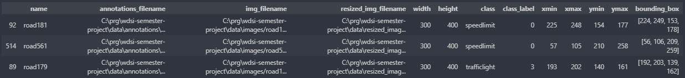
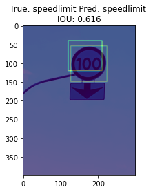
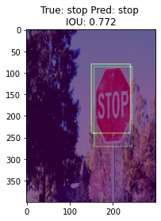
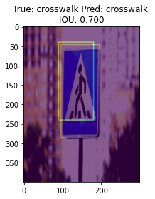
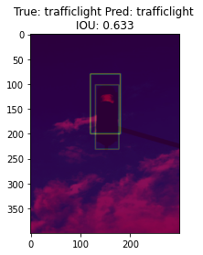

# wdsi-semester-project

This is final project of wdsi semester course. The goal of the project was to develop object detection and classification model for road signs dataset (https://www.kaggle.com/andrewmvd/road-sign-detection).

## Data
Dataset contains 877 image samples of four different classes: Speedlimit, Stop, Traffic Light and Crosswalk.\
The dataset is very inbalanced, most of the samples belong to the speedlimit class.

### Loading data
For easy dataset management, first the annotations are parsed by parsing the xmli and then the pandas datafame is created.\
This solution provides efficient data management, allowing for easy spliting of data.\
\


### Transforming data
In the next step all images with corresponding bounding boxes are resized to 300px wide and 400px high.\
Resized images are saved to data/resized directory.\
\
Due to small amount of data and quite a lot of unbalanced dataset augmentation is applied.\
For each sample used for learning, one of the following transformations is used:
- Color inversion
- Gaussian blur
- Color Jitter

The last transformation is a normalization using the stats for ImageNet.\
Dataset is divided into parts for training, validation and testing.

## Model
The pretrained ResNet18 was used to build the model.\
the last layers have been swapped and separate layers for classification and bounding box location have been added instead.\
\


## Training
Since the problem consists of two components, a special loss function must be constructed.\
The function contains two separate popular loss functions: Cross Entropy Loss and Mean Absolute Error.\
Each of these losses is multiplied by an appropriate factor.\
\
Loss function equation:
```math
loss = CF \cdot \sum_{}{}w(x)log(p_l(x)) + BBF \cdot \frac{1}{n}\sum_{}{}|x_i-x|
```
Where:
CF - Classification factor\
BBF - Bounding box factor\
\
SGD was chosen as the optimizer. Data augmentation allowed for a relatively large learning rate=2e-3 and momentum=0.9.\
The model is learned in two steps, determined by the coefficients of the loss function.\
The first step focuses on classification, while the second step concentrates on the location of the bounding box and only slightly improves the classification quality.\
Each step consists of 15 epochs.\
\
To prevent the classification quality from degrading, the classification factor remains unchanged in the second step.\
This approach helped to achieve better results faster.

## Model Evaluation
To check the quality of the model predictions, classification accuracy and intersection over union are calculated.\
The average values for model accuracy on the test dataset are over 90% and the IOUs are about 0.7.\
\





## Future ideas
This implementation can only detect one class at a time. This causes most incorrect predictions because the model learns from images with multiple classes with only one valid class given. Implementing models like YOLO3 or R-CNN can solve this problem.\
\
This implementation uses augmentation methods that do not rearrange objects in the image. Using more augmentations that need to be applied to the image and bounding box simultaneously, such as rotation, perspective, and blending, would provide better results.\
\
There is still a lot of room for improving the loss function, such as implementing a better loss element for the bounding box. There are many different loss based IOUs that can give better results.

## Bibliography:
https://www.researchgate.net/figure/Original-ResNet-18-Architecture_fig1_336642248
https://ieeexplore.ieee.org/stamp/stamp.jsp?arnumber=8943952
https://www.statisticshowto.com/absolute-error/
